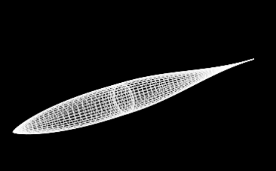

# FuselageLab

FuselageLab is a Python application for exploring the design of fuselage geometries, estimating their aerodynamics from empirical correlations, and exporting results.
It ships with a modern desktop GUI (CustomTkinter) that lets you adjust configuration via a categorized form, run the pipeline, and visualize a 3D model of your fuselage.

## Highlights

- **Modern UI**: Built with CustomTkinter for a sleek, dark-themed experience.
- **Geometries**: Focuses on aerodynamic shapes (Haack series, etc.) for subsonic/transonic drag minimization.
- **Aerodynamics**: Friction correlations (laminar/transition/turbulent) and Hoerner-based estimations.
- **Analysis**: Calculates wetted area, volume, CG locations, and weight properties.
- **Outputs**: CSV profiles, JSON results, and STL exports (ASCII/Binary).
- **Visualization**: Integrated 3D wireframe viewer.



## Requirements

- Python 3.10+
- Packages:
  - `customtkinter`
  - `packaging`
  - `numpy`
  - `matplotlib`
  - `vtk` (optional, for advanced 3D)
  - `plotly` (optional, for interactive 3D)
  - `pywebview` (optional, for embedded interactive 3D)

## Install

1.  **Clone the repository**:
    ```bash
    git clone https://github.com/Luiulator/FuselageLab.git
    cd FuselageLab
    ```

2.  **Install dependencies**:
    ```bash
    pip install -r requirements.txt
    ```

## Run

- **Start the App**:
  ```bash
  python main.py
  ```
- **Legacy Mode**:
  If you need the old Tkinter interface, run:
  ```bash
  python main_legacy.py
  ```

## Using The GUI

- **Sidebar**:
  - **Load/Save**: Manage your configuration JSON files.
  - **Configuration**: Tabs for Geometry, Operation, CF Model, Builder, Mass, I/O, and Plots.
  - **Results**: Real-time summary of aerodynamic coefficients and geometric properties.
  - **Actions**: Run the pipeline, export STL files, or open the results folder.

- **3D View**:
  - The left panel shows a 3D wireframe representation of your fuselage.
  - It updates automatically after a successful run.

## Project Structure

- `main.py`: New entry point (CustomTkinter App).
- `main_legacy.py`: Old entry point (Standard Tkinter).
- `src/gui/`:
  - `app.py`: Main application logic.
  - `views/`: UI components (ConfigForm, ResultsPanel).
  - `viewers/`: 3D viewer implementations.
- `src/pipeline.py`: Orchestrates the calculation flow.
- `src/build.py`: Geometry generation.
- `src/calcs.py`: Aerodynamic and geometric calculations.
- `results/`: Output directory.

## License

No license has been set in this repository.
