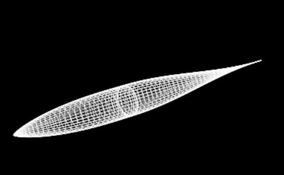

# FuselageLab ✈️

[](https://www.python.org/)
[](LICENSE)

**FuselageLab** is a specialized Python framework designed for the parametric modeling, aerodynamic estimation, and geometric analysis of aircraft fuselages. It combines a robust mathematical builder with a modern desktop GUI for rapid prototyping and design exploration.



## 🚀 Key Features

- **Advanced Parametric Modeling**: 
  - Dynamic nose profiles supporting Haack, Parabolic, and Hermite-Spline series.
  - Asymmetric nose displacement ($h_w$) with anchored tip constraints.
  - Global "Bluntness" control for organic, radome-style fillets.
  - Detailed tail upsweep/upsweep and boattail angle enforcement.
- **High-Fidelity Aerodynamics**:
  - Friction drag estimations across Laminar, Transition, and Turbulent regimes.
  - 3D correction factors and compressibility logic (Mach effects).
  - Hoerner-based empirical correlations for total drag estimation.
- **Geometric Analysis**:
  - Precise wetted area (surface of revolution) and volume integration.
  - Center of Gravity (CG) and mass property estimation based on skin density.
  - Cross-sectional profile verification.
- **Professional Visualization**:
  - Real-time 3D wireframe viewer built with Matplotlib.
  - Integrated schematic panel for reference dimensions.
- **Interoperability**:
  - Export to industry-standard STL format (Binary/ASCII).
  - Profile data export to CSV for CFD preprocessing.
  - Detailed result payloads in JSON.

## 🛠️ Installation

### Prerequisites
- Python 3.10 or higher.

### Steps
1. **Clone the repository**:
   ```bash
   git clone https://github.com/Luiulator/FuselageLab.git
   cd FuselageLab
   ```

2. **Set up a virtual environment (recommended)**:
   ```bash
   python -m venv .venv
   source .venv/bin/activate  # On Windows: .venv\Scripts\activate
   ```

3. **Install dependencies**:
   ```bash
   pip install -r requirements.txt
   ```

## 🖥️ Usage

Start the main application by running:
```bash
python main.py
```

### GUI Operations
- **Sidebar**: Manage configuration files and view real-time Results Summary.
- **Geometry Tab**: Configure explicit dimensions ($L_n, L_c, L_t$, etc.) or relative fractions.
- **Operation Tab**: Set cruise conditions (Velocity, Density, Mach).
- **Builder Tab**: Adjust mesh discretization and export settings.

## 📂 Project Structure

```text
├── main.py              # Application entry point
├── config.json          # Default configuration
├── src/
│   ├── build.py         # Core geometry generation (Nose/Tail/Cabin)
│   ├── calcs.py         # Aerodynamic & Physical equations
│   ├── pipeline.py      # Execution orchestrator
│   ├── gui/
│   │   ├── app.py       # GUI Logic & Lifecycle
│   │   ├── views/       # Tabbed forms & Result panels
│   │   └── viewers/     # 3D Visualization engines
└── results/             # Auto-generated CSV, JSON, and STL outputs
```

## 📝 License
This project is licensed under the **MIT License** - see the [LICENSE](LICENSE) file for details.

## 🤝 Contributing
Contributions are welcome! Please feel free to submit a Pull Request or open an issue for feature requests.

---
*Developed for aerospace engineering research and rapid conceptual design.*
