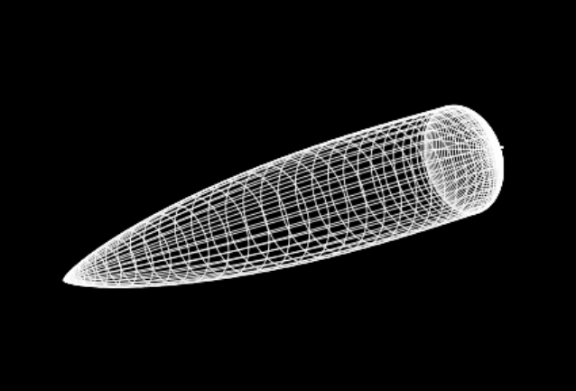
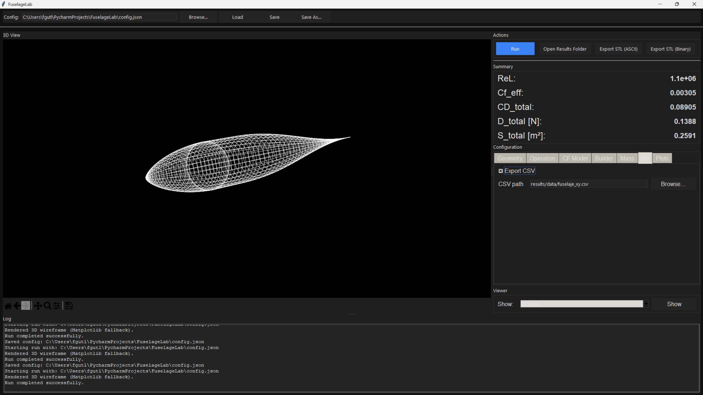

# FuselageLab

FuselageLab es una aplicación en Python para explorar el diseño de geometrías de fuselaje, estimar su aerodinámica a partir de correlaciones empíricas y exportar resultados.  
Incluye una interfaz de escritorio (GUI en Tkinter) que permite ajustar la configuración mediante un formulario categorizado, ejecutar los cálculos y visualizar un modelo 3D del fuselaje.

## Características

- Geometrías disponibles: FuselageLab centra sus capacidades de diseño en formas aerodinámicas estudiadas por investigadores por su minimización de la resistencia en regímenes de flujo subsónico y transónico (sí, ¡puedes usarlo en un cohete!).
- Aerodinámica: correlaciones de fricción (laminar / transición / turbulento) y estimaciones basadas en el capítulo de Hoerner “Fluid Dynamic Drag” sobre cuerpos tipo fuselaje.
- Dimensiones y propiedades de masa: permite calcular los integrales del área mojada, área de base, volumen sólido, posiciones del centro de gravedad a lo largo del eje x y propiedades de peso si se proporciona la densidad del material, por lo que no es necesario usar un programa CAD para esto.
- Salidas: CSV del perfil 2D, JSON con los resultados y gráficas tipo panel de control (*dashboard plots*).
- Exportaciones: STL de la superficie 3D del fuselaje (ASCII o binario).
- GUI: tema oscuro, *wireframe* con Matplotlib ocupando todo el panel en la aplicación; opción de 3D interactivo en un navegador o en una ventana pywebview.

Estas son algunas de las geometrías que puedes diseñar en solo unos clics:

## Requisitos

- Python 3.10+
- Tk (Tkinter forma parte de la biblioteca estándar; en Linux asegúrate de que el *runtime* de Tk está instalado mediante tu gestor de paquetes)
- Paquetes de Python (mínimos):
  - `numpy`
  - `matplotlib`
  - `vtk`

Opcionales (para un 3D más completo):

- Plotly en navegador o ventana pywebview: `plotly`, `pywebview` (en Linux requiere la biblioteca de sistema WebKit2GTK; ver más abajo)
- VTK incrustado en Tk: `vtk` (las compilaciones de sistema pueden incluir o no el módulo para Tk)
- Incrustación HTML heredada (limitada): `tkinterweb`

## Instalación

Puedes instalar las dependencias en un entorno virtual o en tu instalación de usuario de Python.

- Mínimo (GUI + Matplotlib):
  - `pip install numpy matplotlib`

- 3D interactivo vía navegador/pywebview (recomendado):
  - `pip install plotly`
  - `pip install pywebview`
  - Linux (WebKit2GTK para pywebview):
    - Debian/Ubuntu: `sudo apt install libwebkit2gtk-4.1-0`
    - Fedora: `sudo dnf install webkit2gtk4.1`
    - Manjaro/Arch: `sudo pacman -S webkit2gtk`

- VTK nativo en Tk (opcional):
  - `pip install vtk`
  - Nota: muchas compilaciones de VTK en distribuciones están enfocadas a Qt; el componente `libvtkRenderingTk-*.so` puede no estar presente. Si ves un error de carga de esa biblioteca, usa la ruta de navegador/pywebview en su lugar o instala una compilación de VTK que incluya el módulo de renderizado para Tk.

## Ejecución

- Inicia la GUI: `python main.py`
- La ventana carga un `config.json` por defecto (si existe) en el formulario de configuración.
- Ajusta los valores y haz clic en `Run` para ejecutar la tubería; los resultados aparecen en el cuadro de resumen (*Summary*) y el panel 3D se actualiza.
- Ficheros que se escriben bajo `results/`:
  - `results/data/fuselaje_xy.csv` (perfil 2D)
  - `results/data/resultados.json` (resultados numéricos)
  - `results/figs` (gráficas tipo panel de control) cuando está activado

## Uso de la GUI

- Barra superior:
  - Campo de ruta de configuración con controles `Browse…`, `Load`, `Save`, `Save As…`.
- Panel derecho:
  - `Actions`: `Run`, `Open Results Folder`, `Export STL (ASCII)`, `Export STL (Binary)`, `Show Axes` (conmutador) y `Open Interactive 3D`.
  - `Summary`: valores compactos (ReL, Cf_eff, CD_total, D_total, S_total).
  - `Configuration`: pestañas categorizadas (Geometry, Operation, CF Model, Builder, Mass, I/O, Plots) con entradas etiquetadas e interruptores. Usa `Save`/`Load` en la barra superior para guardar/cargar archivos JSON.
- Panel inferior:
  - `Log`: estado y errores.
- Panel izquierdo (3D):
  - *Wireframe* dentro de la GUI (Matplotlib) con fondo negro puro y líneas blancas. Usa la barra de herramientas inferior para pan/zoom básicos.
  - La casilla `Show Axes` conmuta la visibilidad de los ejes (ocultos por defecto para una vista limpia del *wireframe*).
  - Para rotación/zoom totalmente interactivos (3D moderno), usa el botón `Open Interactive 3D` (abre una ventana pywebview cuando está disponible; si no, tu navegador por defecto).

## Referencia de Configuración

La tubería consume una configuración en JSON. Al cargar, se fusiona con los valores por defecto (los valores que no proporcionas se rellenan). La validación rechaza combinaciones obviamente inválidas.

Claves de nivel superior (ver valores por defecto en `src/configio.py`):

- `geom`:
  - `l`: longitud total [m]
  - `d`: diámetro máximo [m]
  - `base_ratio`: relación de resistencia de base (d_base / d) ≥ 0
- `op` (punto de operación):
  - `V`: velocidad del flujo libre [m/s]
  - `rho`: densidad del aire [kg/m³]
  - `nu`: viscosidad cinemática [m²/s]
- `cf_model` (fricción):
  - `mode`: `"laminar" | "transition" | "turbulent"`
  - `k_transition`: término de transición de Hoerner
  - `threeD_correction`: multiplicador para tener en cuenta efectos 3D (> 0)
- `builder` (síntesis de forma):
  - `Ln_frac`: fracción de longitud de morro respecto a `l` (0–1)
  - `C_haack`: parámetro de la familia Haack (0=LD; ~1/3=LV)
  - `Nn`: número de muestras del morro
  - `Lt_frac`: fracción de longitud de cola respecto a `l` (0–1)
  - `r_tip`: radio de la punta de cola [m]
  - `enforce_tail_angle`: booleano; si es verdadero, incrementa la longitud de cola para respetar `alpha_max_deg`
  - `alpha_max_deg`: ángulo máximo de cola [deg]
  - `Nt`: número de muestras de cola
- `mass`:
  - `use_surface_density`: si es verdadero usa `sigma_surface`; en caso contrario usa `rho_material * t_skin`
  - `sigma_surface`: densidad superficial [kg/m²]
  - `rho_material`: densidad del material [kg/m³]
  - `t_skin`: espesor de la envolvente [m]
  - `include_base_disk_area`: incluye el disco de base en los cálculos de área mojada
  - `g`: gravedad [m/s²]
- `io`:
  - `export_csv`: escribe el CSV del perfil
  - `csv_path`: ruta relativa bajo `results/` o absoluta
- `plots`:
  - `make_plots`: genera gráficas tipo panel de control en `results/figs`
  - `dpi`: DPI de las figuras de Matplotlib (≥ 50)

## Qué Hace la Tubería (*Pipeline*)

El código vive en `src/` y está orquestado por `src/pipeline.py`:

- Geometría (`src/build.py`): morro Haack + cilindro + cola cosenoidal, concatenados sin puntos duplicados en las interfaces; devuelve los arrays `x`, `y` y longitudes/radios básicos.
- Aerodinámica (`src/calcs.py`): calcula `Cf` y `Cf_eff`, un factor `F` derivado de Hoerner, resistencia de base (opcional) y totales (CD, D) usando `q = 0.5 ρ V²` y el área frontal.
- Integrales (`src/calcs.py`): área mojada, área de base (opcional), volumen sólido y centroides sencillos en posición x.
- Masa (`src/calcs.py`): masa de la envolvente y peso a partir de propiedades superficiales.
- Salidas (`src/utils.py`): guarda el CSV del perfil y el JSON de resultados; genera las gráficas de panel de control mediante `src/plots.py` (si está activado).

## Visualización 3D

La GUI prioriza un *wireframe* simple y robusto dentro de la aplicación (Matplotlib) y ofrece una opción de 3D interactivo aparte.

- En la aplicación (Matplotlib):
  - Fondo negro (`#000`), *wireframe* blanco; ejes ocultos por defecto con un conmutador.
  - Escalado igual en todos los ejes para evitar distorsión; la vista ocupa todo el panel izquierdo.

- Interactivo (Plotly):
  - Haz clic en `Open Interactive 3D` en la barra de acciones.
  - Si `pywebview` está instalado (y WebKit2GTK presente en Linux), se abre una ventana nativa.
  - En caso contrario, tu navegador por defecto abre `results/interactive_3d.html`.

- VTK (opcional):
  - Si hay disponible una compilación de VTK compatible con Tk, la aplicación incrusta por defecto una vista 3D nativa. Si la inicialización falla (por ejemplo, falta `libvtkRenderingTk-*.so`), hace *fallback* automáticamente.

## Notas para Manjaro / Arch

- Instala WebKit2GTK para pywebview: `sudo pacman -S webkit2gtk`
- Instala VTK: `sudo pacman -S vtk` (si falta el módulo de Tk, usa la ruta navegador/pywebview)

## Resolución de Problemas

- La página de Plotly aparece en blanco dentro de la aplicación:
  - La incrustación heredada (`tkinterweb`) no incluye un motor de JavaScript moderno; usa el botón `Open Interactive 3D` para abrir una ventana pywebview o tu navegador en su lugar.

- Error de VTK: `couldn't load file libvtkRenderingTk-*.so`:
  - Tu compilación de VTK no incluye el módulo de renderizado para Tk. Instala una compilación de VTK con soporte Tk o usa el botón `Open Interactive 3D`.

- Tk no se encuentra en Linux:
  - Instala el *runtime* de Tk de tu distribución (por ejemplo, `sudo pacman -S tk` en Arch/Manjaro).

- No pasa nada al hacer clic en `Open Interactive 3D`:
  - Asegúrate de que `plotly` está instalado en el mismo entorno que ejecuta la aplicación.
  - Comprueba el panel de log; la aplicación hace *fallback* a abrir `results/interactive_3d.html` en tu navegador por defecto.

## Estructura del Proyecto

- `main.py`: aplicación GUI en Tk.
- `src/configio.py`: valores por defecto, validación y cargador de configuración.
- `src/build.py`: construcción de la geometría.
- `src/calcs.py`: aerodinámica, integrales y estimaciones de masa.
- `src/plots.py`: gráficas de panel de control.
- `src/utils.py`: utilidades para CSV/JSON y nombres de archivo.
  - También: generación de malla y exportadores STL (ASCII/binario).
- `results/`: directorio de salida (datos y figuras).

## Extensión

- Añadir leyes de forma: implementa una nueva función en `src/build.py` y llámala desde `build_fuselage`.
- Añadir un modelo de fricción: implementa el modelo en `src/calcs.py` y conéctalo en `aero_from_geometry`.
- Salidas extra: amplía `src/utils.py` y añade interruptores bajo la sección `io` de la configuración.

## Licencia

No se ha definido ninguna licencia en este repositorio. Si planeas distribuirlo o reutilizarlo, añade un archivo de licencia adecuado.
